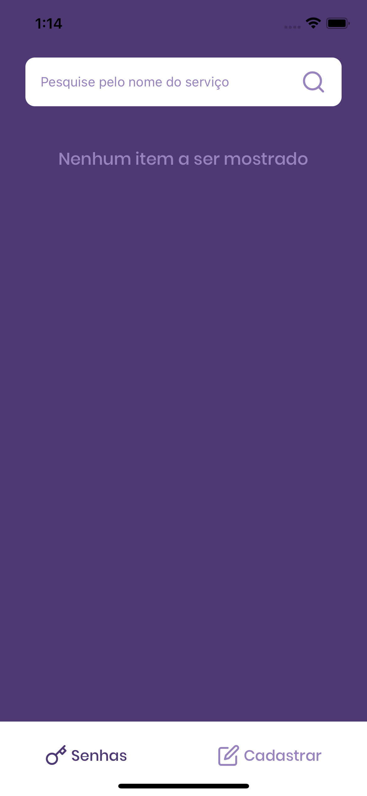
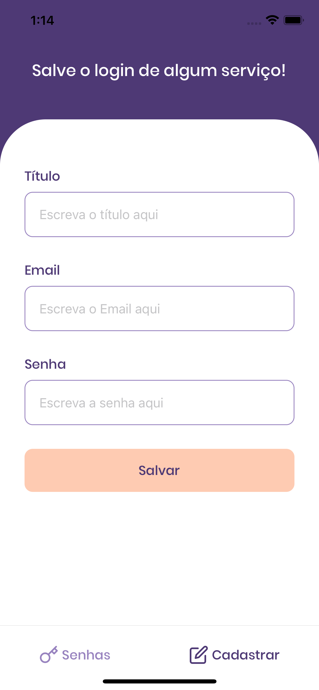

<h1 align="center">
  Desafio PassManager <br>
</h1>

<br>

<h1 align="center">
  
  
  
</h1>

## 💻 Projeto

O PassManager, foi um desafio do bootcamp Ignite da trilha React Native da [Rocketseat](https://rocketseat.com.br/).<br>
Este app e para salvar logins e senhas, teve como objetivo colocar os conhecimentos adquiridos no segundo módulo: Salvamento no AsyncStorage, Themas globais com styled-components e Contexto global com hook.<br>


## Executar aplicação
```bash
# Clone este repositório
$ git clone https://github.com/steephanie/passmanager

# Entre na pasta do projeto.
$ cd PassManager

# Instale as dependências
$ yarn install / npm install

# Execute a aplicação 
$ expo start

```

